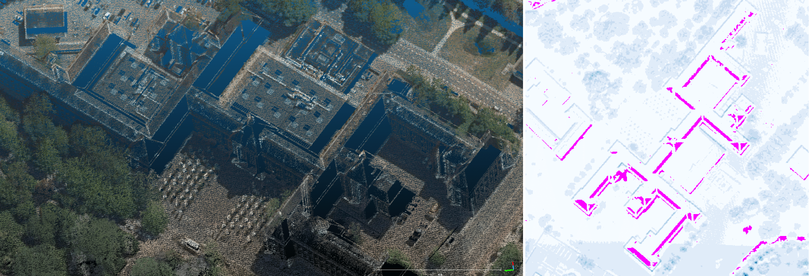
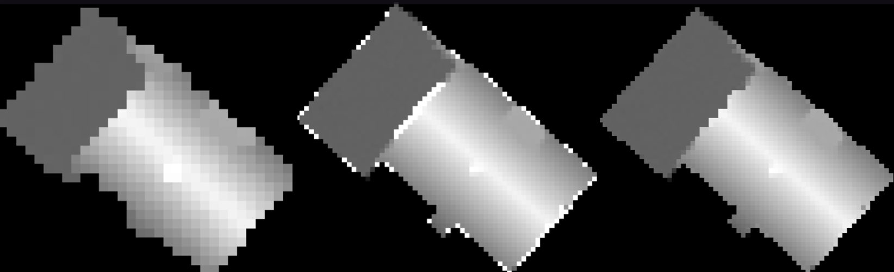

# AHN Inpainter
-----------

## Introduction

### What is AHN?

[*Actueel Hoogtebestand Nederland*](https://www.ahn.nl/) (AHN) is the digital elevation map covering the whole of the Netherlands. It was captured by aerial LiDAR, and contains detailed and precise height information represented by point clouds.

### Why inpaint it?

Due to occlusion, scanning artefacts, and anisotropy of reflectance, the resulting point clouds are not homogeneously distributed: a portion of points are missing from certain regions of the measured ground objects.

 

These no-data gaps would contaminate data integrity, and subsequently result in anomalies in downstream applications, e.g., building reconstruction. Therefore, it would be helpful to have those no-data gaps filled up, where inpainting is needed.

### How to inpaint it?

Since an aerial point cloud typically depicts a 2.5D terrain model, instead of inpainting the 3D point cloud, it is more efficient to lower one dimension and to inpaint the 2D equivalence. To this end, ***AHN Inpainter*** incorporates a toolset for inpainting AHN rasters with neural networks, with the focus on building reconstruction ([3D BAG](https://3dbag.nl/)).

## Requirements

Requirements for this repository alone can be installed via PyPI:
```bash
pip install -r requirements.txt
```

In addition, refer to `networks/{dfnet, glcic}` for the requirements for [DFNet](https://dl.acm.org/doi/10.1145/3343031.3351002) and [GLCIC](https://dl.acm.org/doi/abs/10.1145/3072959.3073659?casa_token=0-rmKkKqKlMAAAAA:VIw6o1unLfxogk0kSL4EK5nAeteZWs0VDq19utHpe9L443fn5QSZEDd_P70_3noLQtXXnveF6EV3gg), respectively.

 ## Usage

The self-contained Python files `{tool_name}.py` are under `utils`, with their respective [Hydra](https://hydra.cc/) configurations under `conf`:

```bash
clean.py      # Clean invalid raster
compare.py    # Compare AHN 3/4 raster
db.py         # Retrieve footprints and point clouds from PostGIS database
download.py   # Download AHN 4 data
mask.py       # Create mask from raster with no-data pixels
merge.py      # Merge AHN 3/4 CityJSON models
overlay.py    # Overlay low-res and high-res raster
split.py      # Split data into train/val/test sets
utils.py      # General utilities
```

The corresponding configuration for each tool can also be accessed with

```bash
python {tool_name}.py --cfg job
```

To use a tool, simply run the relevant Python file with

```bash
python {tool_name}.py
```

Detailed usage are as follows (click &#9658; to expand):

<details><summary><b>Rasterise point clouds</b></summary>
&nbsp;

The point cloud of a building is rasterised into a [GeoTIFF](https://www.ogc.org/standards/geotiff) image where the intensity value of a pixel represents the highest height value of the points that fall into the pixel. In case no points are associated with the pixel, a *no-data* value is assigned. In addition, the raster size is determined by the size of the footprint as well as the specified resolution. For ground pixels outside the footprint, an estimated monotonic height value is assigned.

[Geoflow](https://github.com/geoflow3d/geoflow) is used for the rasterisation process, and [Tile Processor](https://github.com/tudelft3d/tile-processor) is used to parallelise this process across multiple pre-defined tiles:

```bash
tile_processor --loglevel INFO run --threads {num_threads} AHN PCRasterise  {path_config.yml} $(cat tile_ids.txt)
````

A typical configuration file `config.yml`  is of the following structure:

```yaml
database:
    dbname: baseregisters
    host: godzilla.bk.tudelft.nl
    port: {port}
    user: {user}
    password: {password}

features:
    schema: reconstruction_input
    table: reconstruction_input
    field:
        pk: gid
        geometry: geometrie
        uniqueid: identificatie

elevation:
    directories:
        -   {dir_tiles}:
                file_pattern: "t_{tile}.laz"
                priority: 1

features_tiles:
    boundaries:
        schema: tiles
        table: bag_tiles_3k
        field:
            pk: tile_id
            geometry: tile_polygon
            tile: tile_id
    index:
        schema: tiles
        table: bag_index_3k
        field:
            pk: gid
            tile: tile_id

elevation_tiles:
    boundaries:
        schema: {ahn3/ahn4}
        table: tiles_200m
        field:
            pk: fid
            geometry: geom
            tile: fid
            version: ahn_version

output:
    dir: {path_output}

path_executable: {path_geof}
path_flowchart: {path_flowchart.json}
doexec: true
path_toml: {path_geof.toml}
path_lasmerge: {path_lasmerge64}
path_ogr2ogr: {path_ogr2ogr}
```

In `geof.toml` there are a few rasterisation options:

```toml
CELLSIZE=0.50           # cellsize (meter) of each pixel
USE_TIN=false           # whether to enable TIN interpolation to reduce gaps
L=0.0                   # largest triangle length if TIN is enabled
USE_GROUND_POINTS=true  # whether to include ground points
```
</details>

<details><summary><b>Prepare train/val/test sets</b></summary>
&nbsp;

- Overlay raster of different resolution

To facilitate high-quality training data that entails both completeness and high resolution, two rasters of different resolution/completeness from the same building are overlaid.

Create `geof.toml` for high-resolution raster:

```toml
CELLSIZE=0.25
USE_TIN=true
L=2.0
USE_GROUND_POINTS=true
```

Create `geof.toml` for low-resolution raster:

```toml
CELLSIZE=0.50
USE_TIN=false
L=0.0
USE_GROUND_POINTS=true
```

```bash
# configuration at conf/overlay
python utils/overlay.py
```


(From left to right: low-resolution, high-resolution, and overlaid.)

- Clean invalid raster

There are potentially 1x1 rasters generated from the rasterisation, which has to be cleaned out:

```bash
# configuration at conf/clean
python utils/clean.py
```

- Split the data into train/val/test sets

```bash
# configuration at conf/split
python utils/split.py
```

`train` and `val` sets both only include complete rasters **without** *no-data* pixels, while `test` set only includes rasters **with** *no-data* pixels. The former two are used to train and evaluate the neural networks with known height references, while the latter one acts as *wild* examples where no height reference is provided.

- Extract mask from *no-data* (`test`) raster

Artificial masks on height-known buildings are needed for training the inpainting networks. One natural way to create those masks is to clone them from actual missing regions in the data:

```bash
# configuration at conf/mask
python utils/mask.py
```
</details>

<details><summary><b>Train/evaluate inpainting neural networks</b></summary>
&nbsp;

Follow `networks/{submodules}/README.md` for the respective instructions to train the inpainting networks. [DFNet](https://dl.acm.org/doi/10.1145/3343031.3351002) and [GLCIC](https://dl.acm.org/doi/abs/10.1145/3072959.3073659?casa_token=0-rmKkKqKlMAAAAA:VIw6o1unLfxogk0kSL4EK5nAeteZWs0VDq19utHpe9L443fn5QSZEDd_P70_3noLQtXXnveF6EV3gg) are supported. Notice that GLCIC generates its own *box* masks on the fly during training.

The inpainting can be evaluated on examples with known height reference (i.e., the `val` set), or examples without height reference (i.e., the `test` set and other extrapolated ones).
</details>


<details><summary><b>Change detection and model merging</b></summary>
&nbsp;

With the [transition from AHN 3 to AHN 4](https://www.ahn.nl/ahn-4), a considerable amount of buildings have physically changed. To consider those changes for accurate yet up-to-date building reconstruction, a change detection tool is provided to compare the *AHN* 3/4 rasters: a building is considered changed between AHN 3 and AHN 4 if the raster differs significantly between the two.

A significant difference between the two rasters can be addressed by various metrics, such as mean, maxima, percentage of height-differed pixels, etc., which are options covered by `compare.py`:

```bash
# configuration at conf/compare
python utils/compare.py
```

Based on the change detection result, it is possible to merge two city models of [CityJSON](https://www.cityjson.org/) format:

```bash
# configuration at conf/merge
python utils/merge.py
```
</details>

<details><summary><b>Data retrieval</b></summary>
&nbsp;
 
`db.py` and `download.py` provide data retrieval methods from a database or via a public URL.
</details>

## License

[MIT](https://raw.githubusercontent.com/chenzhaiyu/ahninpainter/main/LICENSE)
